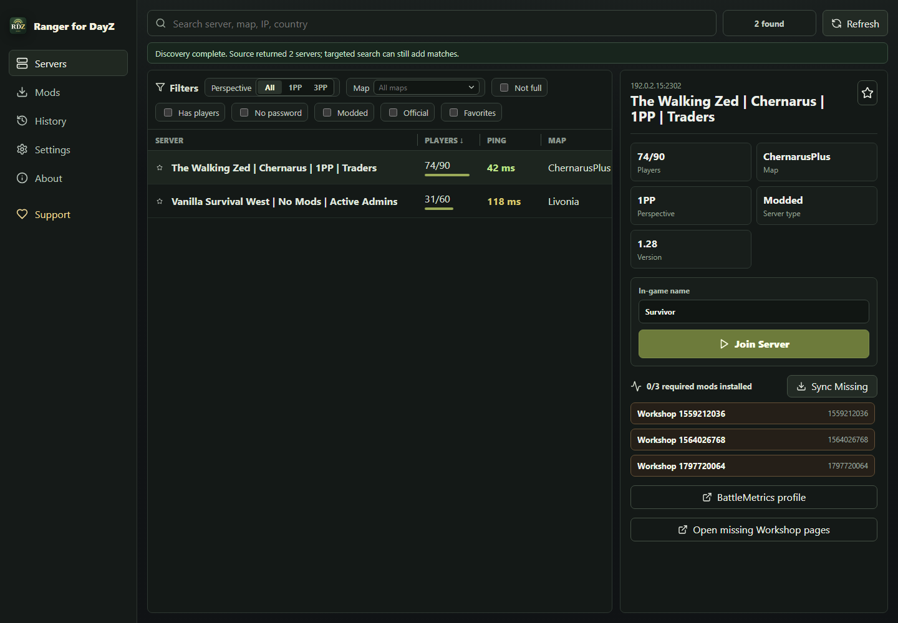

# Ranger for DayZ

Ranger for DayZ is an unofficial Windows DayZ server browser, DayZ launcher, and Steam Workshop mod sync helper. It helps players browse public DayZ servers, check required Workshop mods, sync missing items, and launch DayZ with the selected server and mod list.

This project is not affiliated with, sponsored by, or endorsed by Bohemia Interactive, DayZ, Valve, Steam, or DZSA Launcher. DayZ and related trademarks belong to Bohemia Interactive. Steam and Steam Workshop belong to Valve. Public server-list data is supplied by DZSA Launcher.



## Download

Download the latest Windows installer from [GitHub Releases](https://github.com/RayDeras84/ranger-for-dayz/releases/latest).

On the latest release page, download the asset named `Ranger-for-DayZ-Setup-<version>-x64.exe`. The `.blockmap` and `latest.yml` assets are for automatic updates.

Windows installers are currently unsigned so this project can stay cost-free. Windows may show an "Unknown Publisher" or SmartScreen warning when installing a release, especially while the app is new. Download releases only from this repository's GitHub Releases page.

## Features

- Browse public DayZ servers from the DZSA Launcher feed.
- Filter by search text, map, player count, password, modded status, official status, and favorites.
- Enrich server map/ping details through DayZ server query responses when available.
- Detect Steam, DayZ, Workshop, DZSA, and local mod folders on Windows.
- Compare server Workshop requirements with locally installed mods.
- Sync missing Workshop items through Steam when Steamworks is available.
- Launch DayZ directly with server and mod arguments, with a Steam connect fallback.
- Install through a Windows NSIS installer and check GitHub Releases for updates.

## Requirements

- Windows.
- Node.js and npm for development.
- Steam installed and signed in for Steamworks-backed features.
- A Steam account that owns DayZ for DayZ launch and Workshop sync workflows.

The renderer can run in a browser preview, but native features require Electron.

## Setup

```powershell
npm.cmd install
npm.cmd run dev
```

Useful commands:

```powershell
npm.cmd run build
npm.cmd start
npm.cmd run package
npm.cmd run package:portable
npm.cmd run lint
npm.cmd test
node scripts/qa-server-workflows.mjs
```

Current verification notes:

- `npm.cmd run build` should produce the Vite renderer build in `dist/`.
- `npm.cmd run package` builds a Windows installer in `release/`.
- `npm.cmd run lint` runs ESLint with the flat config in `eslint.config.js`.
- `npm.cmd test` runs Vitest.
- DZSA-backed server QA depends on network availability.
- Steamworks checks depend on Steam, DayZ ownership/install state, and the `steamworks.js` native integration.

## Project Layout

- `electron/main.js`: Electron main process, native integrations, DZSA server-list fetches, direct server query enrichment, Workshop sync, and launch flow.
- `electron/preload.cjs`: context-isolated IPC bridge exposed as `window.dayz`.
- `src/launcherApi.js`: renderer adapter with a browser-preview fallback.
- `src/App.jsx`: main React UI.
- `src/styles.css`: app-wide desktop UI styling.
- `scripts/create-icon.mjs`: generated app icon.
- `scripts/configure-release-metadata.mjs`: CI helper that injects the GitHub owner/repo into release builds.
- `scripts/package-local.mjs`: local Windows package wrapper that writes installer output outside OneDrive-backed repo folders by default.
- `scripts/qa-server-workflows.mjs`: network QA for server search/filter workflows.
- `eslint.config.js`: public-repo ESLint configuration.

## Releases And Updates

Generated installers belong in GitHub Releases, not in git. The `release/` directory is ignored.

Windows installers are currently unsigned so this project can stay cost-free. Windows may show an "Unknown Publisher" or SmartScreen warning when installing a release, especially while the app is new.

Local `npm.cmd run package` writes to `%TEMP%\ranger-for-dayz-release` by default to avoid Windows/OneDrive file locking around electron-builder's temporary folders. Set `RFDZ_RELEASE_DIR` to choose a different output folder.

See [RELEASE.md](RELEASE.md) for the Windows installer, signing, and auto-update release flow.

## Support

If Ranger for DayZ helps you, support through [GitHub Sponsors](https://github.com/sponsors/RayDeras84) is appreciated. Sponsors setup may still be pending while the project is new.

## Privacy And Data

Ranger for DayZ stores settings, favorites, and recent servers in Electron's local `userData` directory on the user's machine. It does not include a hosted backend.

The app contacts external services as part of normal operation:

- DZSA Launcher for public DayZ server listings.
- Steam and Steam Workshop for Workshop pages, subscriptions, and item download status.
- Public DayZ server query ports for map and ping enrichment.

## Legal Notes

Do not add DayZ game assets, Bohemia logos, Workshop mod files, extracted game data, or third-party copyrighted material to this repository unless you have the right to do so.

Steamworks integration is provided through `steamworks.js` and depends on Valve's Steamworks terms and the user's local Steam client. Keep this project under a permissive license unless you have confirmed compatibility with Steamworks redistribution requirements.

## License

This project is licensed under the MIT License. See [LICENSE](LICENSE).
